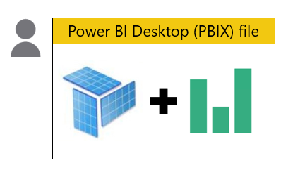
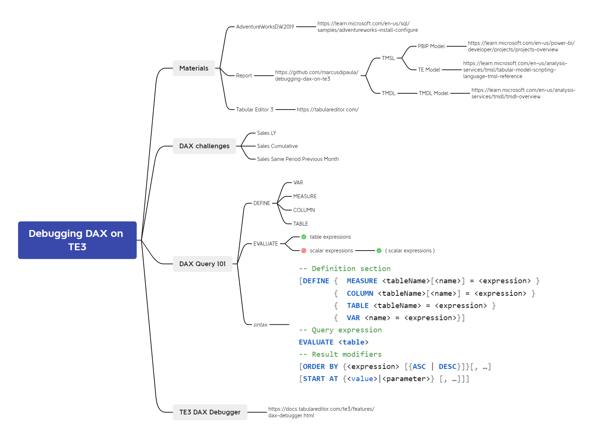
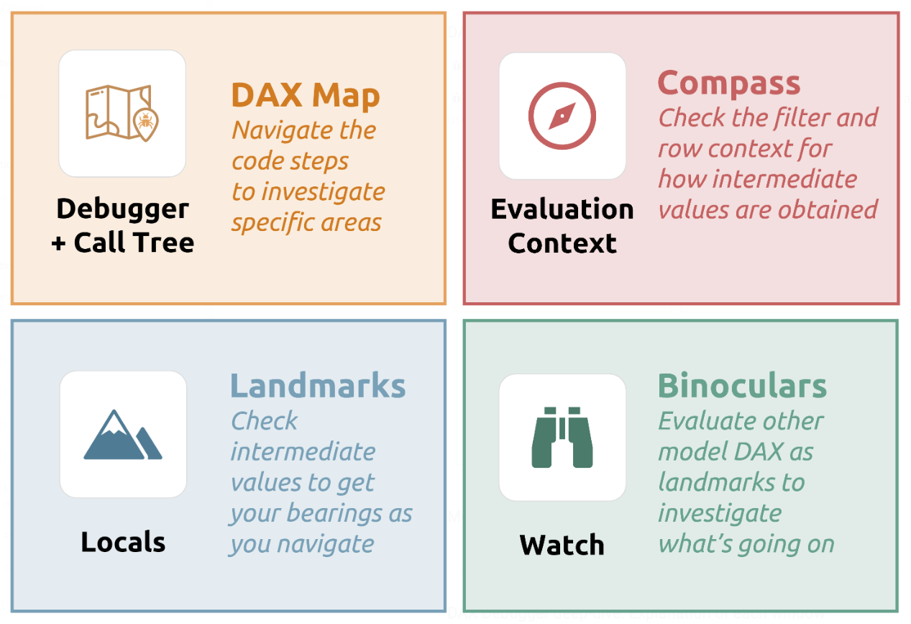

# debugging-dax-on-te3

Este repositório contém os materiais usados para o treinamento **Debugging DAX on Tabular Editor 3**.

## Metadata

Este diretório contém os metadados do modelo tabular em dois formatos
1. [TMSL](https://learn.microsoft.com/en-us/analysis-services/tmsl/tabular-model-scripting-language-tmsl-reference) 
2. [TMDL](https://learn.microsoft.com/en-us/analysis-services/tmdl/tmdl-overview)

Para o primeiro formato, TMSL, temos o modelo tabular salvo em duas estruturas de pastas diferentes.
A primeira estrutura de pastas, `metadata/PBIP Model`, é gerada pelo novo [Power BI Desktop Projects (PBIP)](https://learn.microsoft.com/en-us/power-bi/developer/projects/projects-overview).
A segunda estrutura de pastas, `metadata/TE Model`, é gerada pelo Tabular Editor, seja a versão 2 ou 3.

Temos também uma terceira estrutura de pastas, `metadata/TMDL Model`, gerada pelo Tabular Editor, seja na versão 2 ou 3, contendo os metadados em formato `.tmd`, numa estrutura YAML like.

## Report

Este diretório contém o arquivo PBIX como uma [solução de arquivo único](https://learn.microsoft.com/en-us/power-bi/guidance/report-separate-from-model#single-file-solution) e o _Storage mode_ dos dados como _import_.

## Mind Map

O seguinte mapa mental traz os tópicos abordados no treinamento:

Source: <https://tabulareditor.com/learn>

## Resources

Esta seção contém links de recursos usados no treinamento, que não foram citados no corpo deste README, e outros sugeridos para expansão do conhecimento.
- https://tabulareditor.com/
- https://tabulareditor.com/learn 
- https://docs.tabulareditor.com/te3/features/dax-debugger
- https://daxstudio.org/
- https://dax.guide/
- https://www.sqlbi.com/articles/fields-parameters-in-power-bi/
- https://www.sqlbi.com/articles/debugging-dax-measures-in-power-bi/
- https://learn.microsoft.com/en-us/sql/samples/adventureworks-install-configure